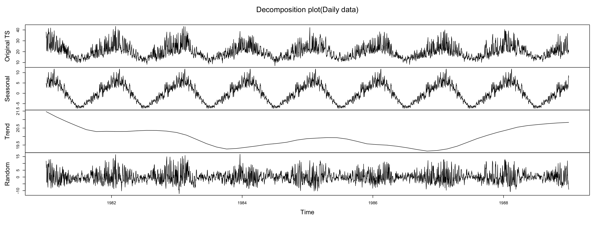

# Analysis of Daily Temperatures in Melbourne

Temperature data is usually analyzed and utilized as time series data. Time series models are frequently used to analyze trends and predict the future.

The goal of this project is to analyze and model temperatures in Melbourne. All corresponding codes (R Markdown) can be found in the [tsp.Rmd](https://github.com/atomxu10/TimeSeriesProject/blob/main/tsp.Rmd).

## Content
- [Data](#1)
- [Methodology](#2)
- [Data exploration (Daily data)](#3)
    - [Structure](#3-1)
    - [Analysis](#3-2)
- [Model I (Monthly data)](#4)
    - [Structure](#4-1)
    - [Model fitting (SARIMA)](#4-2)
        - [Parameter selection](#4-2-1)
        - [Residual analysis](#4-2-2)
- [Model II (Weekly data)](#5)
    - [Structure](#5-1)
    - [Model fitting (ARIMA)](#5-2)
        - [Parameter selection](#5-2-1)
        - [Residual analysis](#5-2-2)
    - [Forecasting](#5-3)
- [Conclusion](#6)

## Data
A time series data set consisting of daily maximum temperatures in Melbourne can be found in the file [TempMelbPRO1](https://github.com/atomxu10/TimeSeriesProject/blob/main/TempMelbPRO.csv). The dataset covers a period of 1 January 1981 to 31 December 1990 and it is kindly provided for educational use by the Time Series Data Library and the data provider DataMarket (DataMarket.com).

## Methodology
The total number of data is 3650. In order to make a final prediction, the data of 1989 and 1990 are used as the test set, and the data of the first eight years are used as the training set.

In terms of data selection, the data dimension is divided into daily data (original data set data), weekly data (weekly average maximum temperature data) and monthly data (monthly average maximum temperature data). The data is not divided by annual average data because of insufficient data volume.

The experimental design steps are as follows:
1. Structuring the data and describing the structure (trend, cyclicality, seasonality)
2. Model selection based on data structure (such as ARIMA or SARIMA)
3. Fitting model (stationary test, order of differences, parameter (p, q) selection)
4. Test model (residual diagnostics)
5. Prediction (comparison with testing set)

## Data exploration (Daily data)
### Structure
Structurally split the original data set. Figure1 shows the data after decomposition which can be seen that the original data shows like wavy, and we guess it is cyclical or seasonal. By observing the image, the trend cannot be clearly described, so the linear regression method is introduced to explore whether there is a trend.

