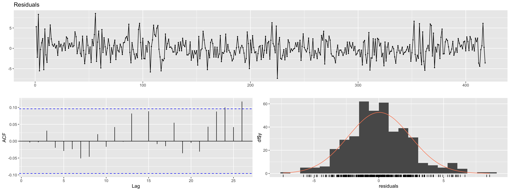

# Analysis of Daily Temperatures in Melbourne

Temperature data is usually analyzed and utilized as time series data. Time series models are frequently used to analyze trends and predict the future.

The goal of this project is to analyze and model temperatures in Melbourne. All corresponding codes (R Markdown) can be found in the [tsp.Rmd](https://github.com/atomxu10/TimeSeriesProject/blob/main/tsp.Rmd).

## Content
- [Data](#1)
- [Methodology](#2)
- [Data exploration (Daily data)](#3)
    - [Structure](#3-1)
    - [Analysis](#3-2)
- [Model I (Monthly data)](#4)
    - [Structure](#4-1)
    - [Model fitting (𝑆𝐴𝑅𝐼𝑀𝐴)](#4-2)
        - [Parameter selection](#4-2-1)
        - [Residual analysis](#4-2-2)
    - [Forecasting](#4-3)
- [Model II (Weekly data)](#5)
    - [Structure](#5-1)
    - [Model fitting (𝐴𝑅𝐼𝑀𝐴)](#5-2)
        - [Parameter selection](#5-2-1)
        - [Residual analysis](#5-2-2)
    - [Forecasting](#5-3)
- [Conclusion](#6)

## Data
A time series data set consisting of daily maximum temperatures in Melbourne can be found in the file [TempMelbPRO1](https://github.com/atomxu10/TimeSeriesProject/blob/main/TempMelbPRO.csv). The dataset covers a period of 1 January 1981 to 31 December 1990 and it is kindly provided for educational use by the Time Series Data Library and the data provider DataMarket (DataMarket.com).

## Methodology
The total number of data is 3650. In order to make a final prediction, the data of 1989 and 1990 are used as the test set, and the data of the first eight years are used as the training set.

In terms of data selection, the data dimension is divided into daily data (original data set data), weekly data (weekly average maximum temperature data) and monthly data (monthly average maximum temperature data). The data is not divided by annual average data because of insufficient data volume.

The experimental design steps are as follows:
1. Structuring the data and describing the structure (trend, cyclicality, seasonality)
2. Model selection based on the data structure (𝐴𝑅𝐼𝑀𝐴, 𝑆𝐴𝑅𝐼𝑀𝐴)
3. Fitting model (stationary test, order of differences, parameter (p, q) selection)
4. Test model (residual diagnostics)
5. Prediction (comparison with testing set)

## Data exploration (Daily data)
### Structure
Structurally split the original data set. Figure 1 shows the data after decomposition which shows that the original data like wavy, and we guess it is cyclical or seasonal.

    

Figure 1: Decomposition plot (Daily data)

By observing the image, the trend cannot be clearly described, so the linear regression method is introduced to explore whether there is a trend. The linear fitting result is shown in [Figure 18](https://github.com/atomxu10/TimeSeriesProject/blob/main/plot2/figure18.png), and the time series data shows a downward trend.

The seasonal and non-seasonal data are separated for observation (Figure 2). The p-value of the ADF test of non-seasonal data [Figure 19](https://github.com/atomxu10/TimeSeriesProject/blob/main/plot2/figure19.png) is less than 0.05, which can be considered that the non-seasonal data is stationary.

    

Figure 2: Non-seasonal data plot (Daily data) & Seasonal data plot (Daily data)

### Analysis
Seasonal difference is required to eliminate the influence of seasonality on the data. However, the seasonal difference function does not support lag greater than 350 in R, therefore the seasonal data is differentiated separately. Figure 3 shows the data image obtained after the first difference, which still shows obvious seasonality, and there is no significant seasonality after the 2nd order difference (Figure 3b). Multiple seasonal differences will reduce the period length of the series, which may cause the model to fail to capture seasonal changes, thus affecting the accuracy of prediction.

In the meanwhile, performing multiple seasonal differences will result in a loss of data, because each difference will reduce the dataset. Therefore, daily data will not be considered as a dataset.

    

Figures 3a & 3b: Seasonal data after the 1st differencing & 2nd differencing 

## Model I (Monthly data)
We proceed by dividing the data into months and taking the mean value to obtain a dataset, consisting of the average maximum temperature of each month. The size of the training set is 96, and the testing set is 24.

### Structure
Figure 4 is the decomposed image of monthly data. Similar to the daily data, the monthly data shows significant seasonality. The degree to which the time series is affected by the 12-month seasonal fluctuation is 0.99. Using regression analysis to test the trend of the time series, the p-values of the regression coefficients are less than 0.05. The series shows a slight downward trend.

    

Figure 4: Decomposition plot (Monthly data) 

### Model fitting (𝑆𝐴𝑅𝐼𝑀𝐴)
We use the SARIMA model to process time series data with seasonal structure. The SARIMA model decomposes the time series into seasonal and non-seasonal components and establishes an ARIMA model for each component separately. The SARIMA model can be expressed as 𝑆𝐴𝑅𝐼𝑀𝐴(𝑝, 𝑑, 𝑞) × (𝑃, 𝐷, 𝑄)𝑠.

Seasonal differencing can eliminate the seasonal structure and make the time series more stationary. Figure 5 is the data after 1st seasonal difference (lag=12). Compared with the data image before the difference, the seasonality after the seasonal difference is not as significant, and the degree of influence by the 12-month seasonal fluctuation is reduced to 0.63 (Figure 22). Multiple seasonal differences may lead to loss of data information. To retain more data and ensure the accuracy of the model, we will no longer continue to perform multiple seasonal differences.

    

Figure 5: Data after 1st seasonal difference 

The ADF test is a commonly used method in time series analysis, which is used to test the stationarity of the sequence. ([Figure 23a](https://github.com/atomxu10/TimeSeriesProject/blob/main/plot2/figure23.png)) is the ADF test result of the data with seasonal differences. The null hypothesis cannot be rejected (H0: the time series is non-stationary), so it cannot be concluded that the time series is stationary.
To obtain a stationary series, the data needs to be differentiated once. The differenced data can be considered as a stable sequence after the ADF stationarity test ([Figure 23b](https://github.com/atomxu10/TimeSeriesProject/blob/main/plot2/figure23-2.png)).

#### Parameter selection
We determine the seasonal AR and MA order by observing the PACF and ACF plots after the seasonal difference to estimate P and Q (Figure 6). The ACF plot (Figure 6a) shows a sharp drop at 1st lag, which suggests that the series can be explained by a moving average model with 1 lag, therefore we set Q = 1. The PACF plot (Figure 6b) shows that almost all values are within the confidence interval and there is no exponential downward trend and set P = 0.

    

Figures 6a and 6b: ACF & PACF plots after 1st seasonal difference 

In the same way, The ACF plot (Figure 7a) shows a sharp drop at 2nd lag, so set q = 2. The PACF plot (Figure 7b) shows a sharp exponential decrease at 2nd lag, so set p = 2.

    

Figures 7a and 7b: ACF & PACF plots after 1st seasonal difference and 1st difference 

The method of selecting parameters by observing the ACF and PACF diagrams is not unique, the selection of parameters requires consideration of the actual scenario. For example, the final model can be determined by comparing the performance of the model (AIC, BIC) under different parameters. The auto.arima function in R gives the recommended model ([Figure 24](https://github.com/atomxu10/TimeSeriesProject/blob/main/plot2/figure24.png)) by checking the quality of the model using information criteria (AIC, BIC). The suggested model given by R is 𝑆𝐴𝑅𝐼𝑀𝐴(0, 1, 2) × (0, 1, 1)12.

    

Table 1: AIC value (𝑆𝐴𝑅𝐼𝑀𝐴(2, 1, 2) × (0, 1, 1)12 & 𝑆𝐴𝑅𝐼𝑀𝐴(0, 1, 2) × (0, 1, 1)12 ) 

AIC values (Table 1) between the two models are very close, we considered involving prediction performance to determine which model is more suitable.

#### Residual analysis
Residual analysis is a method used in statistics to check the quality of fit of a regression model. It is used to check for unexplained parts of the regression model. In time series, residual analysis can be analyzed using the following methods:
1. White noise test
2. Autocorrelation (ACF) of the residual series
3. Normal distribution test of residual series

The details of the residual analysis for the two models are not listed individually here but can be found in [Figure 8](https://github.com/atomxu10/TimeSeriesProject/blob/main/plot2/figure8.png) and [Figure 9](https://github.com/atomxu10/TimeSeriesProject/blob/main/plot2/figure9.png). The conclusion is that both models are suitable for the data.

### Forecasting
Using the testing set (actual data) to compare with the model prediction results, we can determine the accuracy of the prediction results. Figure 11 shows that at a 5% significance level, the residual between the predicted and actual values is small, and the actual value is within the prediction confidence interval (grey region), therefore we can conclude the prediction results from the two models are acceptable.

    

Figure 11: Comparison of actual value and predicted value (Model 1 & Model 2) 

    

Table 2: MSE & MAE (𝑆𝐴𝑅𝐼𝑀𝐴(2, 1, 2) × (0, 1, 1)12 & 𝑆𝐴𝑅𝐼𝑀𝐴(0, 1, 2) × (0, 1, 1)12) 

Table 2 shows that the performance of model 𝑆𝐴𝑅𝐼𝑀𝐴(0, 1, 2) × (0, 1, 1)12 is much better (smaller MSE and MAE values).

## Model II (Weekly data)

It is undeniable that a certain amount of accuracy will have been lost if we simplify the data to monthly averages, likely due to the small size of the dataset. we divided the data set into weekly average data to get more data involved. The size of the training dataset is 418 and the testing set is 106.

### Structure
Figure 12 is the weekly data plot. The plot appears sinusoidal, therefore we assume it may have significant periodicity. Figure 13 is the ACF diagram, which confirms that the data has significant periodicity (lag=52). The linear fitting result of the data is shown in Figure 29. The p-value of the time variable regression coefficient is 0.24, indicating that the trend is not significant at a 5% significance level.

    

Figure 12: Weekly data plot 

    

Figure 13: ACF plot (Weekly data) 

### Model fitting (𝐴𝑅𝐼𝑀𝐴)

The data is significantly cyclical and not seasonal, so we consider using an ARIMA model. The ADF stationarity test result (Figure 30) shows that the p-value is less than the significance level of 0.05, therefore the null hypothesis is rejected (H0: the time series is a non-stationary series) and the time series is considered to be stationary (no difference required).

#### Parameter selection
The ACF plot (Figure 14a) shows a sharp drop at the 2nd lag, suggesting that the series can be explained by a moving average model with 2 lag, so we set q = 2. The PACF (Figure 14b) plot shows an exponential downward trend when lag=3, so we set p = 3. Therefore, the model can be expressed as 𝐴𝑅𝐼𝑀𝐴(3, 0, 2).

    

Figure 14: ACF & PACF plots (Weekly data) 

The recommended model is given by the auto.arima function in R is 𝐴𝑅𝐼𝑀𝐴(5, 0, 1). From the comparison of the two models (Table 3), it can be seen that the AIC and RMSE values
of 𝐴𝑅𝐼𝑀𝐴(3, 0, 2) are smaller, which means that the performance of the model on the training set is much better.

    

Table 3: AIC & RMSE (𝐴𝑅𝐼𝑀𝐴(3, 0, 2) & 𝐴𝑅𝐼𝑀𝐴(5, 0, 1)) 

#### Residual analysis
The p-value of the white noise test result is 0.66 ([Figure 31](https://github.com/atomxu10/TimeSeriesProject/blob/main/plot2/figure31.png)), which is greater than the significance level of 0.05. Therefore, the null hypothesis cannot be rejected and the residual sequence is considered to be white noise at a 5% significance level. The residuals ACF plot (Figure 15b) shows that almost all values fall within the confidence interval, so the autocorrelation is likely to be insignificant. The shape of the distribution (Figure 15c) is approximately normally distributed, but it still needs to be tested. The Shapiro-Wilk normality test result ([Figure 32](https://github.com/atomxu10/TimeSeriesProject/blob/main/plot2/figure32.png)) shows that p-value=0.002, so at a 5% significance level, we reject the null hypothesis, i.e. the residual series does not fit a normal distribution. 

    

Figure 15a-15c: Residuals Plot & Residuals ACF & Residuals Distribution 

Considering the data sample is small and the model passes the white noise test, the model is acceptable but still not perfect.

### Forecasting
The data of the first 418 weeks are used as training data in the prediction model. Figure 16 is a forecasting plot from the ARIMA model for the subsequent 108 weeks.

    

Figure 16: Forecasting plot (Weekly data) 

